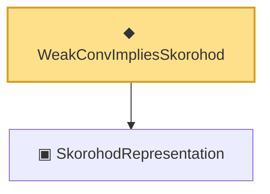

# Proof narrative — WeakConvImpliesSkorohod

Root: **WeakConvImpliesSkorohod** (def) `Statlib/Mathlib/ProbabilityTheory/SkorohodArgmax.lean:124` · topic `Mathlib`
Closure: 2 declarations across 1 files. Generated from `proof_graph.json` — no files were moved.

Reading order (foundations first, headline last):

  ▣ `SkorohodRepresentation` — structure · `Statlib/Mathlib/ProbabilityTheory/SkorohodArgmax.lean:76`  _(also used by 1: skorohodRepresentation_dirac)_
◆ `WeakConvImpliesSkorohod` — def · `Statlib/Mathlib/ProbabilityTheory/SkorohodArgmax.lean:124` **← headline**

## Dependency diagram

