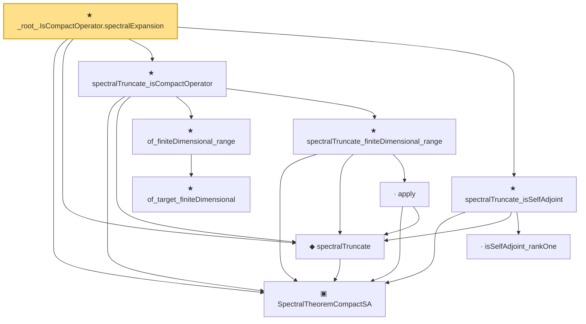

# Proof narrative — _root_.IsCompactOperator.spectralExpansion

Root: **_root_.IsCompactOperator.spectralExpansion** (theorem) `Statlib/Mathlib/Analysis/SpectralTruncation.lean:245` · topic `Mathlib`
Closure: 10 declarations across 2 files. Generated from `proof_graph.json` — no files were moved.

Reading order (foundations first, headline last):

  ▣ `SpectralTheoremCompactSA` — structure · `Statlib/Mathlib/Analysis/SpectralCompactSelfAdjoint.lean:299`  _(also used by 27: SpectralEigenbasisIsTotal, SpectralTheoremCompactSA.toHilbertBasis, inner_eigenfn_spectralTruncate_lt, …)_
  ◆ `spectralTruncate` — noncomputable def · `Statlib/Mathlib/Analysis/SpectralTruncation.lean:98`  _(also used by 13: inner_eigenfn_spectralTruncate_lt, inner_eigenfn_spectralTruncate_ge, inner_eigenfn_residual, …)_
      ★ `of_target_finiteDimensional` — theorem · `Statlib/Mathlib/Analysis/SpectralCompactSelfAdjoint.lean:111`
    ★ `of_finiteDimensional_range` — theorem · `Statlib/Mathlib/Analysis/SpectralCompactSelfAdjoint.lean:131`  _(also used by 2: truncate_isCompactOperator, isCompactOperator_trunc)_
      · `apply` — lemma · `Statlib/Mathlib/Analysis/SpectralTruncation.lean:107`  _(also used by 13: inner_eigenfn_spectralTruncate_lt, inner_eigenfn_spectralTruncate_ge, isCompactOperator_of_op_norm_tendsto, …)_
    ★ `spectralTruncate_finiteDimensional_range` — theorem · `Statlib/Mathlib/Analysis/SpectralTruncation.lean:148`  _(also used by 1: compactSpectralTruncationOfBessel)_
  ★ `spectralTruncate_isCompactOperator` — theorem · `Statlib/Mathlib/Analysis/SpectralTruncation.lean:177`
    · `isSelfAdjoint_rankOne` — lemma · `Statlib/Mathlib/Analysis/SpectralTruncation.lean:121`
  ★ `spectralTruncate_isSelfAdjoint` — theorem · `Statlib/Mathlib/Analysis/SpectralTruncation.lean:134`  _(also used by 1: compactSpectralTruncationOfBessel)_
★ `_root_.IsCompactOperator.spectralExpansion` — theorem · `Statlib/Mathlib/Analysis/SpectralTruncation.lean:245` **← headline**

## Dependency diagram

