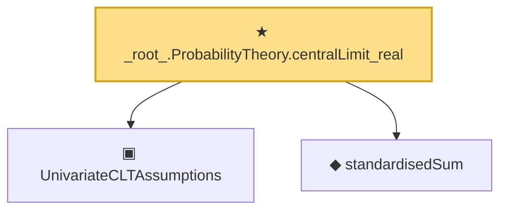

# Proof narrative — _root_.ProbabilityTheory.centralLimit_real

Root: **_root_.ProbabilityTheory.centralLimit_real** (theorem) `Statlib/Mathlib/ProbabilityTheory/CentralLimitNamed.lean:197` · topic `Mathlib`
Closure: 3 declarations across 1 files. Generated from `proof_graph.json` — no files were moved.

Reading order (foundations first, headline last):

  ▣ `UnivariateCLTAssumptions` — structure · `Statlib/Mathlib/ProbabilityTheory/CentralLimitNamed.lean:163`  _(also used by 1: centralLimit_real_to_existing)_
  ◆ `standardisedSum` — noncomputable def · `Statlib/Mathlib/ProbabilityTheory/CentralLimitNamed.lean:153`  _(also used by 1: centralLimit_real_to_existing)_
★ `_root_.ProbabilityTheory.centralLimit_real` — theorem · `Statlib/Mathlib/ProbabilityTheory/CentralLimitNamed.lean:197` **← headline**

## Dependency diagram

