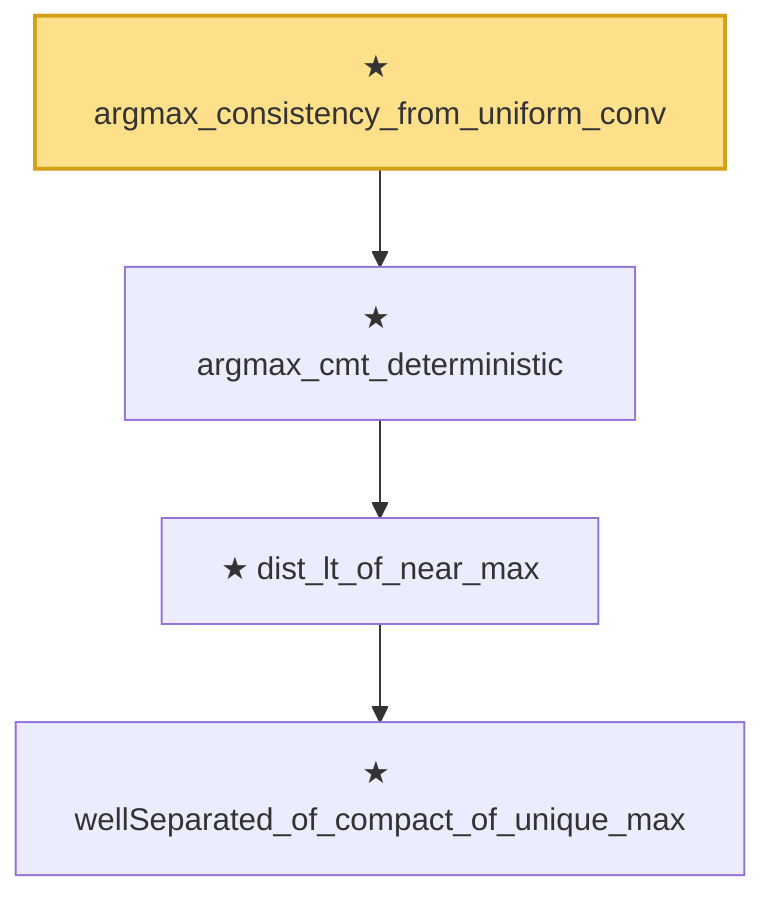

# Proof narrative — argmax_consistency_from_uniform_conv

Root: **argmax_consistency_from_uniform_conv** (theorem) `Statlib/Mathlib/ProbabilityTheory/ArgmaxCMT.lean:142` · topic `Mathlib`
Closure: 4 declarations across 2 files. Generated from `proof_graph.json` — no files were moved.

Reading order (foundations first, headline last):

      ★ `wellSeparated_of_compact_of_unique_max` — theorem · `Statlib/CoxChangePoint/Identifiability.lean:43`  _(also used by 1: CoxIdentifiability.wellSeparated)_
    ★ `dist_lt_of_near_max` — theorem · `Statlib/CoxChangePoint/Identifiability.lean:97`
  ★ `argmax_cmt_deterministic` — theorem · `Statlib/Mathlib/ProbabilityTheory/ArgmaxCMT.lean:76`  _(also used by 1: stochasticArgmaxCMT_of_pointwise_uniform_convergence)_
★ `argmax_consistency_from_uniform_conv` — theorem · `Statlib/Mathlib/ProbabilityTheory/ArgmaxCMT.lean:142` **← headline**

## Dependency diagram

