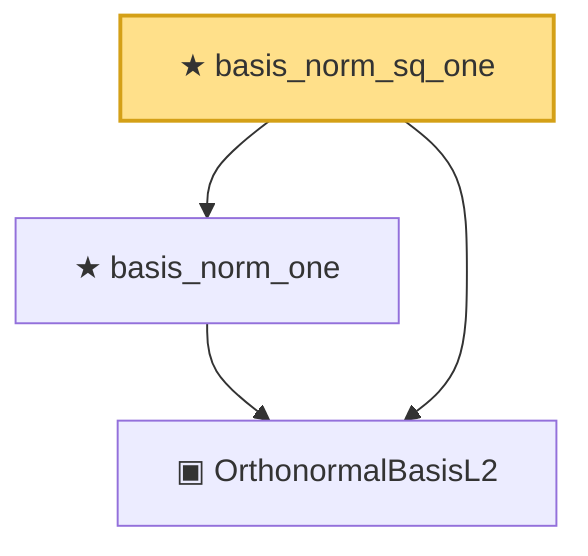

# Proof narrative — basis_norm_sq_one

Root: **basis_norm_sq_one** (theorem) `Statlib/Mathlib/MeasureTheory/L2Separable.lean:140` · topic `Mathlib`
Closure: 3 declarations across 1 files. Generated from `proof_graph.json` — no files were moved.

Reading order (foundations first, headline last):

  ▣ `OrthonormalBasisL2` — structure · `Statlib/Mathlib/MeasureTheory/L2Separable.lean:108`  _(also used by 7: L2Separable.toSeparableSpace, basis_orthogonal, basis_inner_self, …)_
  ★ `basis_norm_one` — theorem · `Statlib/Mathlib/MeasureTheory/L2Separable.lean:122`  _(also used by 1: basis_inner_self)_
★ `basis_norm_sq_one` — theorem · `Statlib/Mathlib/MeasureTheory/L2Separable.lean:140` **← headline**

## Dependency diagram

