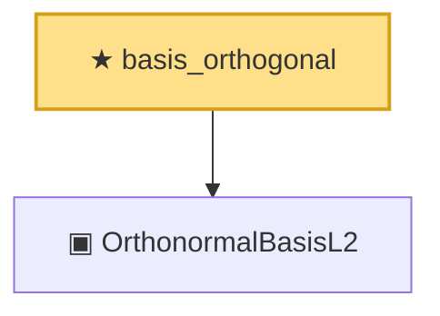

# Proof narrative — basis_orthogonal

Root: **basis_orthogonal** (theorem) `Statlib/Mathlib/MeasureTheory/L2Separable.lean:127` · topic `Mathlib`
Closure: 2 declarations across 1 files. Generated from `proof_graph.json` — no files were moved.

Reading order (foundations first, headline last):

  ▣ `OrthonormalBasisL2` — structure · `Statlib/Mathlib/MeasureTheory/L2Separable.lean:108`  _(also used by 8: L2Separable.toSeparableSpace, basis_norm_one, basis_inner_self, …)_
★ `basis_orthogonal` — theorem · `Statlib/Mathlib/MeasureTheory/L2Separable.lean:127` **← headline**

## Dependency diagram

