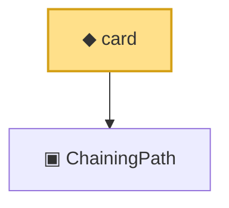

# Proof narrative — card

Root: **card** (noncomputable def) `Statlib/Mathlib/EmpiricalProcess/VWChainingInduction.lean:109` · topic `Mathlib`
Closure: 2 declarations across 1 files. Generated from `proof_graph.json` — no files were moved.

Reading order (foundations first, headline last):

  ▣ `ChainingPath` — structure · `Statlib/Mathlib/EmpiricalProcess/VWChainingInduction.lean:92`
◆ `card` — noncomputable def · `Statlib/Mathlib/EmpiricalProcess/VWChainingInduction.lean:109` **← headline**

## Dependency diagram

