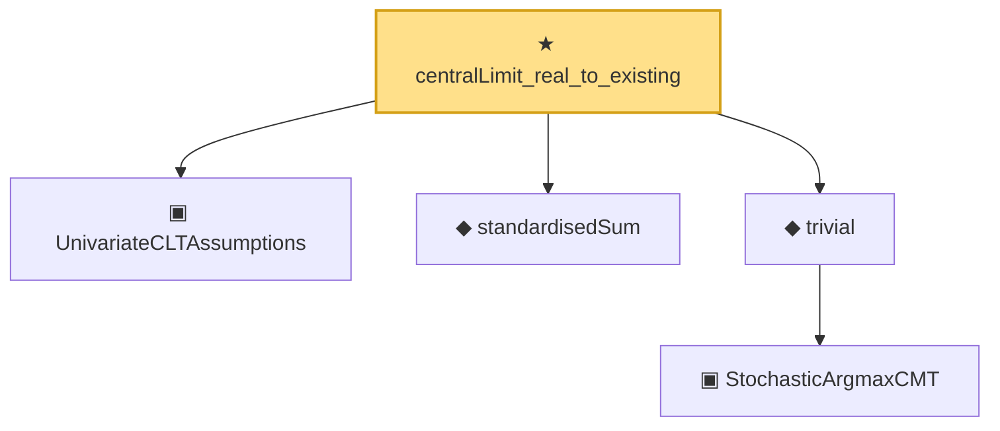

# Proof narrative — centralLimit_real_to_existing

Root: **centralLimit_real_to_existing** (theorem) `Statlib/Mathlib/ProbabilityTheory/CentralLimitNamed.lean:224` · topic `Mathlib`
Closure: 5 declarations across 2 files. Generated from `proof_graph.json` — no files were moved.

Reading order (foundations first, headline last):

  ▣ `UnivariateCLTAssumptions` — structure · `Statlib/Mathlib/ProbabilityTheory/CentralLimitNamed.lean:163`  _(also used by 1: _root_.ProbabilityTheory.centralLimit_real)_
  ◆ `standardisedSum` — noncomputable def · `Statlib/Mathlib/ProbabilityTheory/CentralLimitNamed.lean:153`  _(also used by 1: _root_.ProbabilityTheory.centralLimit_real)_
    ▣ `StochasticArgmaxCMT` — structure · `Statlib/Mathlib/ProbabilityTheory/ArgmaxCMT.lean:179`  _(also used by 1: ofDeterministic)_
  ◆ `trivial` — def · `Statlib/Mathlib/ProbabilityTheory/ArgmaxCMT.lean:199`  _(also used by 1: ofDeterministic)_
★ `centralLimit_real_to_existing` — theorem · `Statlib/Mathlib/ProbabilityTheory/CentralLimitNamed.lean:224` **← headline**

## Dependency diagram

