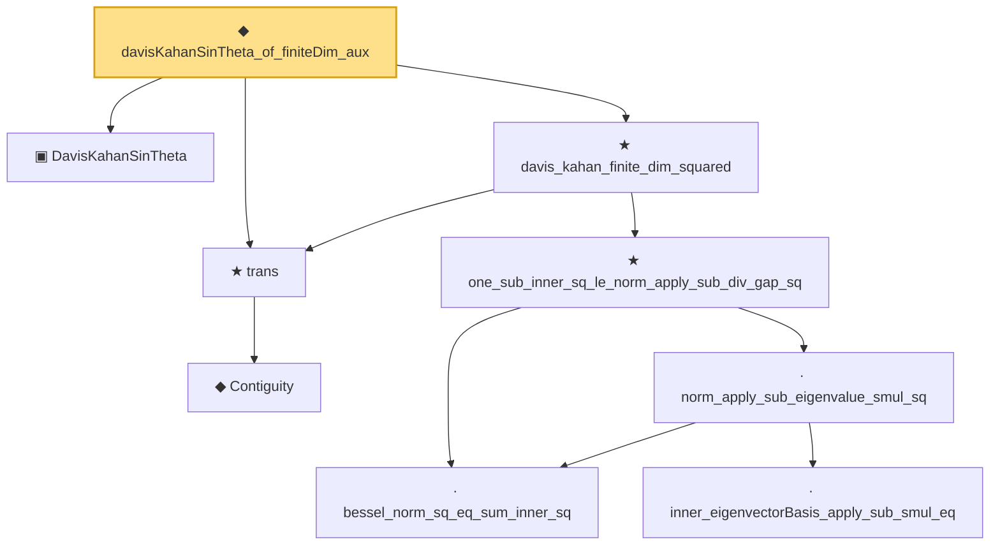

# Proof narrative — davisKahanSinTheta_of_finiteDim_aux

Root: **davisKahanSinTheta_of_finiteDim_aux** (noncomputable def) `Statlib/Mathlib/Analysis/DavisKahanSquaredSin.lean:315` · topic `Mathlib`
Closure: 9 declarations across 3 files. Generated from `proof_graph.json` — no files were moved.

Reading order (foundations first, headline last):

  ▣ `DavisKahanSinTheta` — structure · `Statlib/Mathlib/Analysis/DavisKahan.lean:255`
      ◆ `Contiguity` — def · `Statlib/Mathlib/Statistics/LeCamThirdLemma.lean:86`  _(also used by 8: LANToLeCamBundle, fromCoxScoreSample, identityCov, …)_
  ★ `trans` — theorem · `Statlib/Mathlib/Statistics/LeCamThirdLemma.lean:104`  _(also used by 10: davis_kahan_inner_bound, union_bound_max_tail, dudleySum_le_2D_sup_log_root, …)_
      · `bessel_norm_sq_eq_sum_inner_sq` — lemma · `Statlib/Mathlib/Analysis/DavisKahanSquaredSin.lean:73`  _(also used by 1: sum_inner_sq_eq_one_of_unit)_
        · `inner_eigenvectorBasis_apply_sub_smul_eq` — lemma · `Statlib/Mathlib/Analysis/DavisKahanSquaredSin.lean:94`
      · `norm_apply_sub_eigenvalue_smul_sq` — lemma · `Statlib/Mathlib/Analysis/DavisKahanSquaredSin.lean:117`
    ★ `one_sub_inner_sq_le_norm_apply_sub_div_gap_sq` — theorem · `Statlib/Mathlib/Analysis/DavisKahanSquaredSin.lean:142`
  ★ `davis_kahan_finite_dim_squared` — theorem · `Statlib/Mathlib/Analysis/DavisKahanSquaredSin.lean:242`
◆ `davisKahanSinTheta_of_finiteDim_aux` — noncomputable def · `Statlib/Mathlib/Analysis/DavisKahanSquaredSin.lean:315` **← headline**

## Dependency diagram

