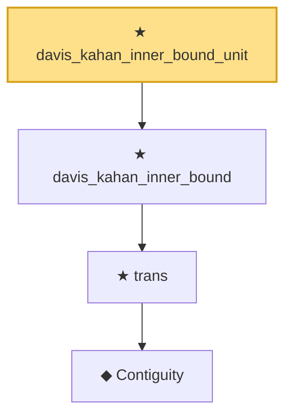

# Proof narrative — davis_kahan_inner_bound_unit

Root: **davis_kahan_inner_bound_unit** (theorem) `Statlib/Mathlib/Analysis/DavisKahan.lean:218` · topic `Mathlib`
Closure: 4 declarations across 2 files. Generated from `proof_graph.json` — no files were moved.

Reading order (foundations first, headline last):

      ◆ `Contiguity` — def · `Statlib/Mathlib/Statistics/LeCamThirdLemma.lean:86`  _(also used by 8: LANToLeCamBundle, fromCoxScoreSample, identityCov, …)_
    ★ `trans` — theorem · `Statlib/Mathlib/Statistics/LeCamThirdLemma.lean:104`  _(also used by 11: davis_kahan_finite_dim_squared, davisKahanSinTheta_of_finiteDim_aux, union_bound_max_tail, …)_
  ★ `davis_kahan_inner_bound` — theorem · `Statlib/Mathlib/Analysis/DavisKahan.lean:177`
★ `davis_kahan_inner_bound_unit` — theorem · `Statlib/Mathlib/Analysis/DavisKahan.lean:218` **← headline**

## Dependency diagram

