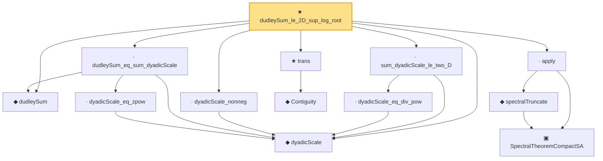

# Proof narrative — dudleySum_le_2D_sup_log_root

Root: **dudleySum_le_2D_sup_log_root** (theorem) `Statlib/Mathlib/EmpiricalProcess/VWChaining.lean:343` · topic `Mathlib`
Closure: 13 declarations across 4 files. Generated from `proof_graph.json` — no files were moved.

Reading order (foundations first, headline last):

  ◆ `dudleySum` — noncomputable def · `Statlib/Mathlib/EmpiricalProcess/VWChaining.lean:300`  _(also used by 3: dudleySum_nonneg, dudleySum_mono, dudley_entropy_integral_bound)_
  ◆ `dyadicScale` — noncomputable def · `Statlib/Mathlib/EmpiricalProcess/VWChaining.lean:101`  _(also used by 4: dyadicScale_succ, dyadicScale_pos, dyadicScale_tendsto_zero, …)_
    · `dyadicScale_eq_zpow` — lemma · `Statlib/Mathlib/EmpiricalProcess/VWChaining.lean:132`
  · `dudleySum_eq_sum_dyadicScale` — lemma · `Statlib/Mathlib/EmpiricalProcess/VWChaining.lean:327`
    ▣ `SpectralTheoremCompactSA` — structure · `Statlib/Mathlib/Analysis/SpectralCompactSelfAdjoint.lean:299`  _(also used by 31: SpectralEigenbasisIsTotal, SpectralTheoremCompactSA.toHilbertBasis, inner_eigenfn_spectralTruncate_lt, …)_
    ◆ `spectralTruncate` — noncomputable def · `Statlib/Mathlib/Analysis/SpectralTruncation.lean:98`  _(also used by 17: inner_eigenfn_spectralTruncate_lt, inner_eigenfn_spectralTruncate_ge, inner_eigenfn_residual, …)_
  · `apply` — lemma · `Statlib/Mathlib/Analysis/SpectralTruncation.lean:107`  _(also used by 13: inner_eigenfn_spectralTruncate_lt, inner_eigenfn_spectralTruncate_ge, isCompactOperator_of_op_norm_tendsto, …)_
  · `dyadicScale_nonneg` — lemma · `Statlib/Mathlib/EmpiricalProcess/VWChaining.lean:118`
    ◆ `Contiguity` — def · `Statlib/Mathlib/Statistics/LeCamThirdLemma.lean:86`  _(also used by 8: LANToLeCamBundle, fromCoxScoreSample, identityCov, …)_
  ★ `trans` — theorem · `Statlib/Mathlib/Statistics/LeCamThirdLemma.lean:104`  _(also used by 11: davis_kahan_inner_bound, davis_kahan_finite_dim_squared, davisKahanSinTheta_of_finiteDim_aux, …)_
    · `dyadicScale_eq_div_pow` — lemma · `Statlib/Mathlib/EmpiricalProcess/VWChaining.lean:140`  _(also used by 1: dyadicScale_tendsto_zero)_
  · `sum_dyadicScale_le_two_D` — lemma · `Statlib/Mathlib/EmpiricalProcess/VWChaining.lean:166`
★ `dudleySum_le_2D_sup_log_root` — theorem · `Statlib/Mathlib/EmpiricalProcess/VWChaining.lean:343` **← headline**

## Dependency diagram

