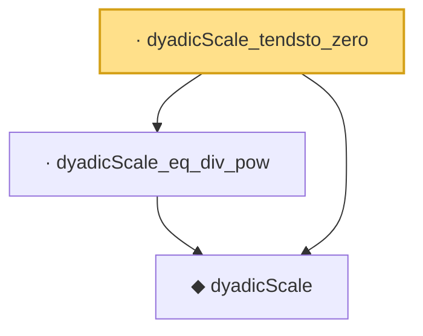

# Proof narrative — dyadicScale_tendsto_zero

Root: **dyadicScale_tendsto_zero** (lemma) `Statlib/Mathlib/EmpiricalProcess/VWChaining.lean:148` · topic `Mathlib`
Closure: 3 declarations across 1 files. Generated from `proof_graph.json` — no files were moved.

Reading order (foundations first, headline last):

  ◆ `dyadicScale` — noncomputable def · `Statlib/Mathlib/EmpiricalProcess/VWChaining.lean:101`  _(also used by 8: dyadicScale_succ, dyadicScale_nonneg, dyadicScale_pos, …)_
  · `dyadicScale_eq_div_pow` — lemma · `Statlib/Mathlib/EmpiricalProcess/VWChaining.lean:140`  _(also used by 1: sum_dyadicScale_le_two_D)_
· `dyadicScale_tendsto_zero` — lemma · `Statlib/Mathlib/EmpiricalProcess/VWChaining.lean:148` **← headline**

## Dependency diagram

