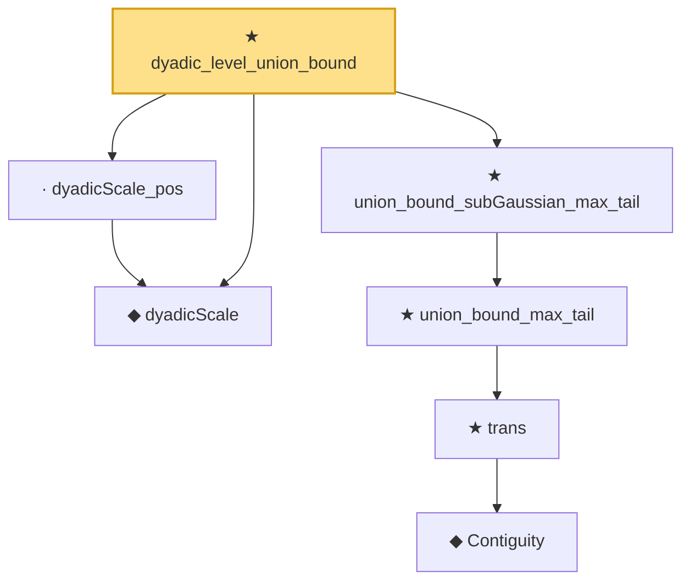

# Proof narrative — dyadic_level_union_bound

Root: **dyadic_level_union_bound** (theorem) `Statlib/Mathlib/EmpiricalProcess/VWChaining.lean:275` · topic `Mathlib`
Closure: 7 declarations across 2 files. Generated from `proof_graph.json` — no files were moved.

Reading order (foundations first, headline last):

  ◆ `dyadicScale` — noncomputable def · `Statlib/Mathlib/EmpiricalProcess/VWChaining.lean:101`  _(also used by 8: dyadicScale_succ, dyadicScale_nonneg, dyadicScale_eq_zpow, …)_
        ◆ `Contiguity` — def · `Statlib/Mathlib/Statistics/LeCamThirdLemma.lean:86`  _(also used by 8: LANToLeCamBundle, fromCoxScoreSample, identityCov, …)_
      ★ `trans` — theorem · `Statlib/Mathlib/Statistics/LeCamThirdLemma.lean:104`  _(also used by 11: davis_kahan_inner_bound, davis_kahan_finite_dim_squared, davisKahanSinTheta_of_finiteDim_aux, …)_
    ★ `union_bound_max_tail` — theorem · `Statlib/Mathlib/EmpiricalProcess/VWChaining.lean:234`
  ★ `union_bound_subGaussian_max_tail` — theorem · `Statlib/Mathlib/EmpiricalProcess/VWChaining.lean:259`
  · `dyadicScale_pos` — lemma · `Statlib/Mathlib/EmpiricalProcess/VWChaining.lean:125`
★ `dyadic_level_union_bound` — theorem · `Statlib/Mathlib/EmpiricalProcess/VWChaining.lean:275` **← headline**

## Dependency diagram

