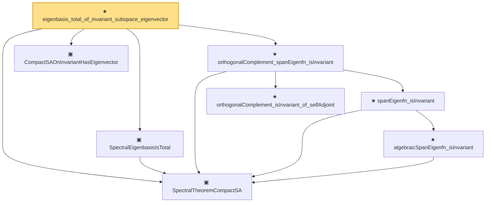

# Proof narrative — eigenbasis_total_of_invariant_subspace_eigenvector

Root: **eigenbasis_total_of_invariant_subspace_eigenvector** (theorem) `Statlib/Mathlib/Analysis/EigenbasisTotality.lean:228` · topic `Mathlib`
Closure: 8 declarations across 3 files. Generated from `proof_graph.json` — no files were moved.

Reading order (foundations first, headline last):

  ▣ `SpectralTheoremCompactSA` — structure · `Statlib/Mathlib/Analysis/SpectralCompactSelfAdjoint.lean:299`  _(also used by 28: SpectralTheoremCompactSA.toHilbertBasis, inner_eigenfn_spectralTruncate_lt, inner_eigenfn_spectralTruncate_ge, …)_
  ▣ `CompactSAOnInvariantHasEigenvector` — structure · `Statlib/Mathlib/Analysis/EigenbasisTotality.lean:190`  _(also used by 1: rieszSchauderToCompactSAOnInvariantHasEigenvector)_
  ▣ `SpectralEigenbasisIsTotal` — structure · `Statlib/Mathlib/Analysis/BesselCompactSA.lean:63`  _(also used by 4: SpectralTheoremCompactSA.toHilbertBasis, besselSquaredNormBound_of_total, spectralTruncate_tendsto_op_norm_complete, …)_
    ★ `orthogonalComplement_isInvariant_of_selfAdjoint` — theorem · `Statlib/Mathlib/Analysis/EigenbasisTotality.lean:140`
      ★ `algebraicSpanEigenfn_isInvariant` — theorem · `Statlib/Mathlib/Analysis/EigenbasisTotality.lean:88`
    ★ `spanEigenfn_isInvariant` — theorem · `Statlib/Mathlib/Analysis/EigenbasisTotality.lean:112`
  ★ `orthogonalComplement_spanEigenfn_isInvariant` — theorem · `Statlib/Mathlib/Analysis/EigenbasisTotality.lean:167`
★ `eigenbasis_total_of_invariant_subspace_eigenvector` — theorem · `Statlib/Mathlib/Analysis/EigenbasisTotality.lean:228` **← headline**

## Dependency diagram

