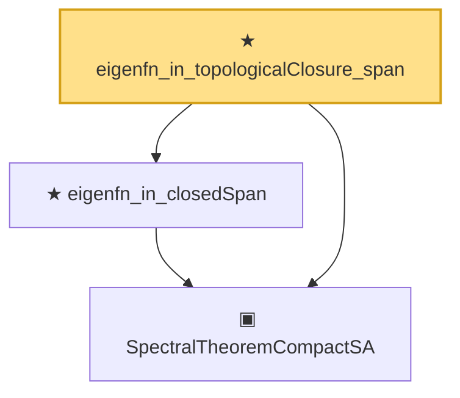

# Proof narrative — eigenfn_in_topologicalClosure_span

Root: **eigenfn_in_topologicalClosure_span** (theorem) `Statlib/Mathlib/Analysis/EigenbasisTotality.lean:77` · topic `Mathlib`
Closure: 3 declarations across 2 files. Generated from `proof_graph.json` — no files were moved.

Reading order (foundations first, headline last):

  ▣ `SpectralTheoremCompactSA` — structure · `Statlib/Mathlib/Analysis/SpectralCompactSelfAdjoint.lean:299`  _(also used by 31: SpectralEigenbasisIsTotal, SpectralTheoremCompactSA.toHilbertBasis, inner_eigenfn_spectralTruncate_lt, …)_
  ★ `eigenfn_in_closedSpan` — theorem · `Statlib/Mathlib/Analysis/EigenbasisTotality.lean:71`
★ `eigenfn_in_topologicalClosure_span` — theorem · `Statlib/Mathlib/Analysis/EigenbasisTotality.lean:77` **← headline**

## Dependency diagram

