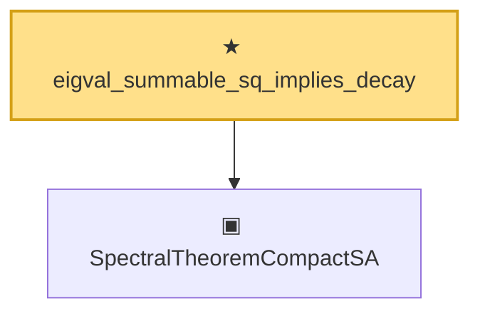

# Proof narrative — eigval_summable_sq_implies_decay

Root: **eigval_summable_sq_implies_decay** (theorem) `Statlib/Mathlib/Analysis/BesselCompactSA.lean:285` · topic `Mathlib`
Closure: 2 declarations across 2 files. Generated from `proof_graph.json` — no files were moved.

Reading order (foundations first, headline last):

  ▣ `SpectralTheoremCompactSA` — structure · `Statlib/Mathlib/Analysis/SpectralCompactSelfAdjoint.lean:299`  _(also used by 32: SpectralEigenbasisIsTotal, SpectralTheoremCompactSA.toHilbertBasis, inner_eigenfn_spectralTruncate_lt, …)_
★ `eigval_summable_sq_implies_decay` — theorem · `Statlib/Mathlib/Analysis/BesselCompactSA.lean:285` **← headline**

## Dependency diagram

