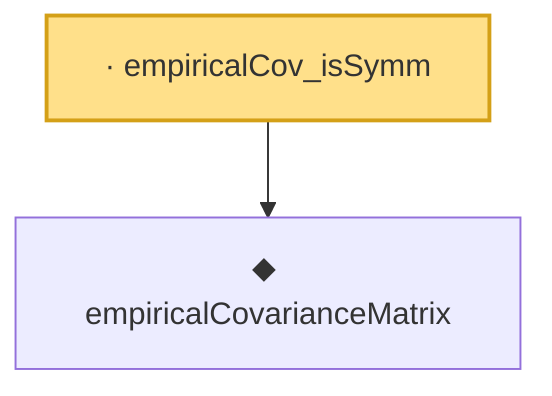

# Proof narrative — empiricalCov_isSymm

Root: **empiricalCov_isSymm** (lemma) `Statlib/Mathlib/ProbabilityTheory/RandomMatrixOpNorm.lean:93` · topic `Mathlib`
Closure: 2 declarations across 1 files. Generated from `proof_graph.json` — no files were moved.

Reading order (foundations first, headline last):

  ◆ `empiricalCovarianceMatrix` — noncomputable def · `Statlib/Mathlib/ProbabilityTheory/RandomMatrixOpNorm.lean:85`  _(also used by 1: empiricalCov_isHermitian)_
· `empiricalCov_isSymm` — lemma · `Statlib/Mathlib/ProbabilityTheory/RandomMatrixOpNorm.lean:93` **← headline**

## Dependency diagram

