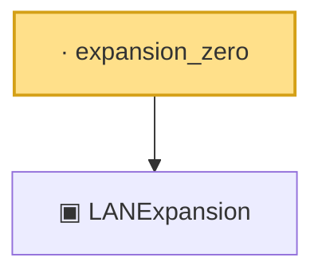

# Proof narrative — expansion_zero

Root: **expansion_zero** (lemma) `Statlib/Mathlib/Statistics/LAN.lean:193` · topic `Mathlib`
Closure: 2 declarations across 1 files. Generated from `proof_graph.json` — no files were moved.

Reading order (foundations first, headline last):

  ▣ `LANExpansion` — structure · `Statlib/Mathlib/Statistics/LAN.lean:152`  _(also used by 9: toLANExpansion, CoxModel.toCoxTheorem3Hypotheses, cox_theorem_3_end_to_end, …)_
· `expansion_zero` — lemma · `Statlib/Mathlib/Statistics/LAN.lean:193` **← headline**

## Dependency diagram

