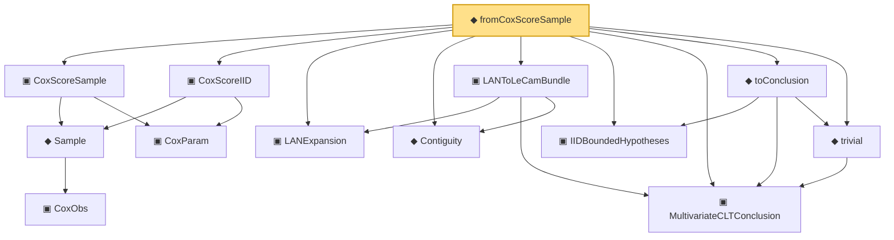

# Proof narrative — fromCoxScoreSample

Root: **fromCoxScoreSample** (noncomputable def) `Statlib/Mathlib/Statistics/LeCamInstance.lean:324` · topic `Mathlib`
Closure: 13 declarations across 7 files. Generated from `proof_graph.json` — no files were moved.

Reading order (foundations first, headline last):

      ▣ `CoxObs` — structure · `Statlib/CoxChangePoint/Foundation.lean:38`  _(also used by 42: TruncSample, benchmark_obs, coxScoreAt, …)_
    ◆ `Sample` — def · `Statlib/CoxChangePoint/Foundation.lean:127`  _(also used by 22: benchmark_sample, CoxLANExpansionHypothesis, coxLogRatio, …)_
    ▣ `CoxParam` — structure · `Statlib/CoxChangePoint/Foundation.lean:57`  _(also used by 71: liftAuto, concreteGn, buildLemmaS1Data, …)_
  ▣ `CoxScoreSample` — structure · `Statlib/Mathlib/ProbabilityTheory/CoxIIDInstance.lean:92`  _(also used by 2: CoxScoreSample.toIIDBoundedHypotheses, CoxScoreSample.score_dim_match)_
  ▣ `CoxScoreIID` — structure · `Statlib/Mathlib/ProbabilityTheory/CoxIIDInstance.lean:121`  _(also used by 1: CoxScoreSample.toIIDBoundedHypotheses)_
  ▣ `LANExpansion` — structure · `Statlib/Mathlib/Statistics/LAN.lean:152`  _(also used by 8: toLANExpansion, CoxModel.toCoxTheorem3Hypotheses, cox_theorem_3_end_to_end, …)_
  ◆ `Contiguity` — def · `Statlib/Mathlib/Statistics/LeCamThirdLemma.lean:86`  _(also used by 7: identityCov, refl, trans, …)_
  ▣ `MultivariateCLTConclusion` — structure · `Statlib/Mathlib/ProbabilityTheory/MultivariateCLT.lean:138`  _(also used by 6: iidBounded, centralLimit_to_multivariateCLTConclusion, MultivariateCLTConclusion.toScoreCLT, …)_
  ▣ `LANToLeCamBundle` — structure · `Statlib/Mathlib/Statistics/LeCamInstance.lean:112`  _(also used by 6: toHajekLeCam, toLeCamThirdLemma, toHajekLeCamViaThird, …)_
  ▣ `IIDBoundedHypotheses` — structure · `Statlib/Mathlib/ProbabilityTheory/CLTSums.lean:129`  _(also used by 7: bound_pos, mean_eq, aestronglyMeasurable, …)_
  ◆ `trivial` — def · `Statlib/Mathlib/ProbabilityTheory/MultivariateCLT.lean:161`  _(also used by 3: centralLimit_to_multivariateCLTConclusion, multivariateCLTOfCramerWold, identityCov)_
  ◆ `toConclusion` — def · `Statlib/Mathlib/ProbabilityTheory/CLTSums.lean:171`  _(also used by 2: iidBounded, IIDBoundedHypotheses.toMultivariateCLTConclusion)_
◆ `fromCoxScoreSample` — noncomputable def · `Statlib/Mathlib/Statistics/LeCamInstance.lean:324` **← headline**

## Dependency diagram

