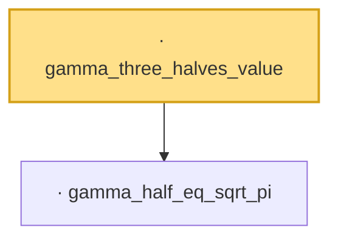

# Proof narrative — gamma_three_halves_value

Root: **gamma_three_halves_value** (lemma) `Statlib/Mathlib/EmpiricalProcess/BracketingIntegralConv.lean:125` · topic `Mathlib`
Closure: 2 declarations across 1 files. Generated from `proof_graph.json` — no files were moved.

Reading order (foundations first, headline last):

  · `gamma_half_eq_sqrt_pi` — lemma · `Statlib/Mathlib/EmpiricalProcess/BracketingIntegralConv.lean:120`
· `gamma_three_halves_value` — lemma · `Statlib/Mathlib/EmpiricalProcess/BracketingIntegralConv.lean:125` **← headline**

## Dependency diagram

