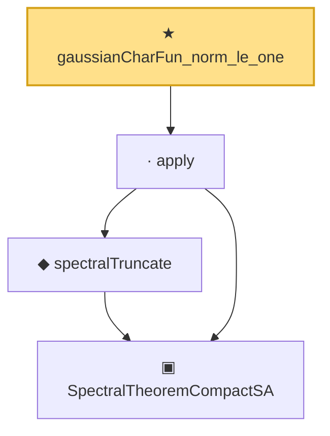

# Proof narrative — gaussianCharFun_norm_le_one

Root: **gaussianCharFun_norm_le_one** (theorem) `Statlib/Mathlib/ProbabilityTheory/CentralLimitNamed.lean:245` · topic `Mathlib`
Closure: 4 declarations across 3 files. Generated from `proof_graph.json` — no files were moved.

Reading order (foundations first, headline last):

    ▣ `SpectralTheoremCompactSA` — structure · `Statlib/Mathlib/Analysis/SpectralCompactSelfAdjoint.lean:299`  _(also used by 31: SpectralEigenbasisIsTotal, SpectralTheoremCompactSA.toHilbertBasis, inner_eigenfn_spectralTruncate_lt, …)_
    ◆ `spectralTruncate` — noncomputable def · `Statlib/Mathlib/Analysis/SpectralTruncation.lean:98`  _(also used by 17: inner_eigenfn_spectralTruncate_lt, inner_eigenfn_spectralTruncate_ge, inner_eigenfn_residual, …)_
  · `apply` — lemma · `Statlib/Mathlib/Analysis/SpectralTruncation.lean:107`  _(also used by 13: inner_eigenfn_spectralTruncate_lt, inner_eigenfn_spectralTruncate_ge, isCompactOperator_of_op_norm_tendsto, …)_
★ `gaussianCharFun_norm_le_one` — theorem · `Statlib/Mathlib/ProbabilityTheory/CentralLimitNamed.lean:245` **← headline**

## Dependency diagram

