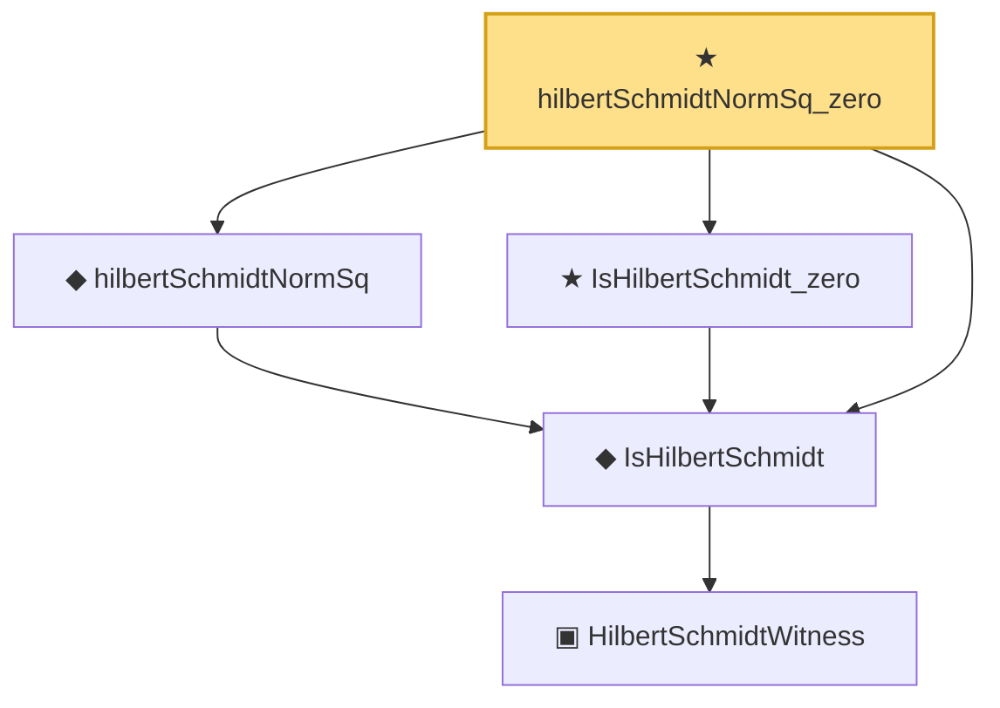

# Proof narrative — hilbertSchmidtNormSq_zero

Root: **hilbertSchmidtNormSq_zero** (theorem) `Statlib/Mathlib/Analysis/HilbertSchmidt.lean:131` · topic `Mathlib`
Closure: 5 declarations across 1 files. Generated from `proof_graph.json` — no files were moved.

Reading order (foundations first, headline last):

      ▣ `HilbertSchmidtWitness` — structure · `Statlib/Mathlib/Analysis/HilbertSchmidt.lean:74`  _(also used by 1: toHilbertSchmidtWitness)_
  ◆ `IsHilbertSchmidt` — def · `Statlib/Mathlib/Analysis/HilbertSchmidt.lean:88`  _(also used by 8: IsHilbertSchmidt.isCompactOperator_via_truncate_complete, IsHilbertSchmidt.smul, IsHilbertSchmidt.summable_of_hilbertBasis, …)_
  ◆ `hilbertSchmidtNormSq` — noncomputable def · `Statlib/Mathlib/Analysis/HilbertSchmidt.lean:122`
  ★ `IsHilbertSchmidt_zero` — theorem · `Statlib/Mathlib/Analysis/HilbertSchmidt.lean:92`
★ `hilbertSchmidtNormSq_zero` — theorem · `Statlib/Mathlib/Analysis/HilbertSchmidt.lean:131` **← headline**

## Dependency diagram

