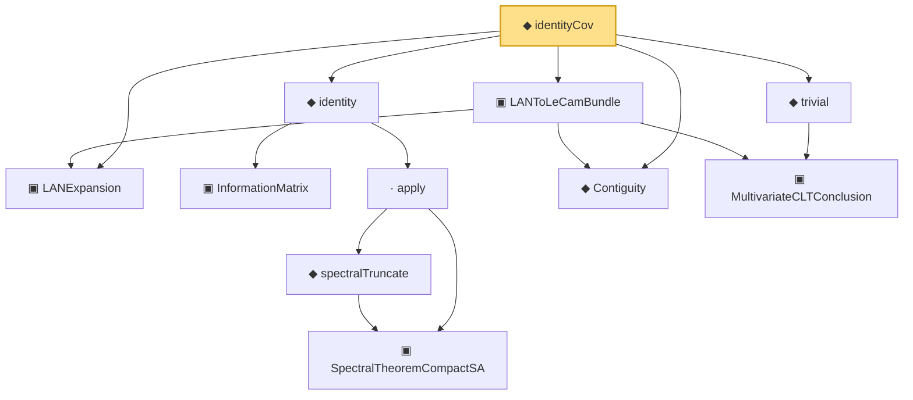

# Proof narrative — identityCov

Root: **identityCov** (def) `Statlib/Mathlib/Statistics/LeCamInstance.lean:413` · topic `Mathlib`
Closure: 11 declarations across 6 files. Generated from `proof_graph.json` — no files were moved.

Reading order (foundations first, headline last):

  ▣ `LANExpansion` — structure · `Statlib/Mathlib/Statistics/LAN.lean:152`  _(also used by 8: toLANExpansion, CoxModel.toCoxTheorem3Hypotheses, cox_theorem_3_end_to_end, …)_
    ▣ `InformationMatrix` — structure · `Statlib/Mathlib/Statistics/LAN.lean:79`
      ▣ `SpectralTheoremCompactSA` — structure · `Statlib/Mathlib/Analysis/SpectralCompactSelfAdjoint.lean:299`  _(also used by 31: SpectralEigenbasisIsTotal, SpectralTheoremCompactSA.toHilbertBasis, inner_eigenfn_spectralTruncate_lt, …)_
      ◆ `spectralTruncate` — noncomputable def · `Statlib/Mathlib/Analysis/SpectralTruncation.lean:98`  _(also used by 17: inner_eigenfn_spectralTruncate_lt, inner_eigenfn_spectralTruncate_ge, inner_eigenfn_residual, …)_
    · `apply` — lemma · `Statlib/Mathlib/Analysis/SpectralTruncation.lean:107`  _(also used by 13: inner_eigenfn_spectralTruncate_lt, inner_eigenfn_spectralTruncate_ge, isCompactOperator_of_op_norm_tendsto, …)_
  ◆ `identity` — def · `Statlib/Mathlib/Statistics/LAN.lean:95`  _(also used by 1: identityCov_info_eq_one)_
  ◆ `Contiguity` — def · `Statlib/Mathlib/Statistics/LeCamThirdLemma.lean:86`  _(also used by 7: fromCoxScoreSample, refl, trans, …)_
    ▣ `MultivariateCLTConclusion` — structure · `Statlib/Mathlib/ProbabilityTheory/MultivariateCLT.lean:138`  _(also used by 8: toConclusion, iidBounded, centralLimit_to_multivariateCLTConclusion, …)_
  ▣ `LANToLeCamBundle` — structure · `Statlib/Mathlib/Statistics/LeCamInstance.lean:112`  _(also used by 6: toHajekLeCam, toLeCamThirdLemma, toHajekLeCamViaThird, …)_
  ◆ `trivial` — def · `Statlib/Mathlib/ProbabilityTheory/MultivariateCLT.lean:161`  _(also used by 4: toConclusion, centralLimit_to_multivariateCLTConclusion, multivariateCLTOfCramerWold, …)_
◆ `identityCov` — def · `Statlib/Mathlib/Statistics/LeCamInstance.lean:413` **← headline**

## Dependency diagram

