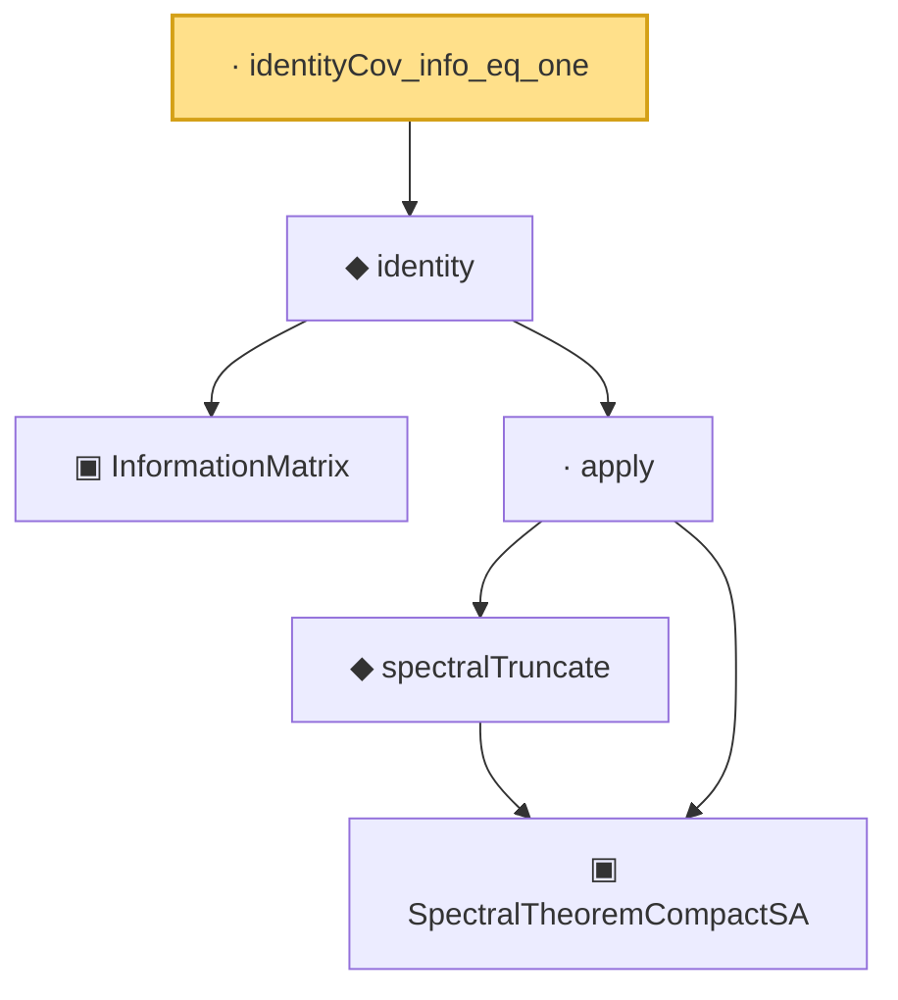

# Proof narrative — identityCov_info_eq_one

Root: **identityCov_info_eq_one** (lemma) `Statlib/Mathlib/Statistics/LeCamInstance.lean:405` · topic `Mathlib`
Closure: 6 declarations across 4 files. Generated from `proof_graph.json` — no files were moved.

Reading order (foundations first, headline last):

    ▣ `InformationMatrix` — structure · `Statlib/Mathlib/Statistics/LAN.lean:79`
      ▣ `SpectralTheoremCompactSA` — structure · `Statlib/Mathlib/Analysis/SpectralCompactSelfAdjoint.lean:299`  _(also used by 31: SpectralEigenbasisIsTotal, SpectralTheoremCompactSA.toHilbertBasis, inner_eigenfn_spectralTruncate_lt, …)_
      ◆ `spectralTruncate` — noncomputable def · `Statlib/Mathlib/Analysis/SpectralTruncation.lean:98`  _(also used by 17: inner_eigenfn_spectralTruncate_lt, inner_eigenfn_spectralTruncate_ge, inner_eigenfn_residual, …)_
    · `apply` — lemma · `Statlib/Mathlib/Analysis/SpectralTruncation.lean:107`  _(also used by 13: inner_eigenfn_spectralTruncate_lt, inner_eigenfn_spectralTruncate_ge, isCompactOperator_of_op_norm_tendsto, …)_
  ◆ `identity` — def · `Statlib/Mathlib/Statistics/LAN.lean:95`  _(also used by 1: identityCov)_
· `identityCov_info_eq_one` — lemma · `Statlib/Mathlib/Statistics/LeCamInstance.lean:405` **← headline**

## Dependency diagram

