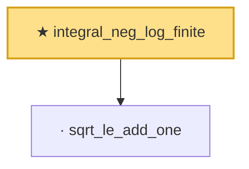

# Proof narrative — integral_neg_log_finite

Root: **integral_neg_log_finite** (theorem) `Statlib/Mathlib/EmpiricalProcess/BracketingIntegralConv.lean:140` · topic `Mathlib`
Closure: 2 declarations across 1 files. Generated from `proof_graph.json` — no files were moved.

Reading order (foundations first, headline last):

  · `sqrt_le_add_one` — lemma · `Statlib/Mathlib/EmpiricalProcess/BracketingIntegralConv.lean:100`  _(also used by 1: polynomialBracketingClass_integrand_pointwise_bound)_
★ `integral_neg_log_finite` — theorem · `Statlib/Mathlib/EmpiricalProcess/BracketingIntegralConv.lean:140` **← headline**

## Dependency diagram

