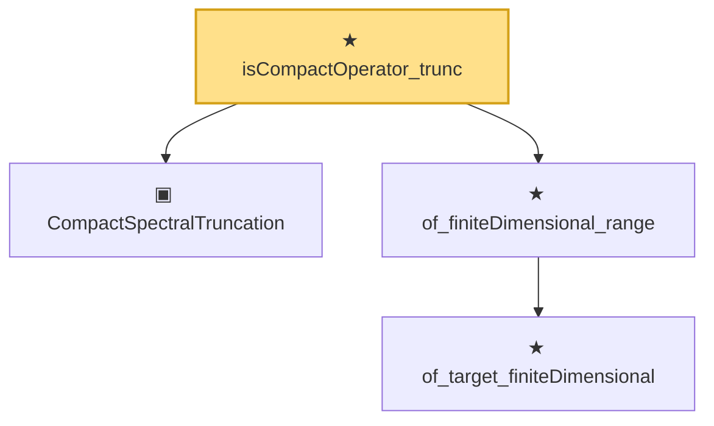

# Proof narrative — isCompactOperator_trunc

Root: **isCompactOperator_trunc** (theorem) `Statlib/Mathlib/Analysis/SpectralCompactSelfAdjoint.lean:275` · topic `Mathlib`
Closure: 4 declarations across 1 files. Generated from `proof_graph.json` — no files were moved.

Reading order (foundations first, headline last):

  ▣ `CompactSpectralTruncation` — structure · `Statlib/Mathlib/Analysis/SpectralCompactSelfAdjoint.lean:258`  _(also used by 2: compactSpectralTruncationOfTotal, compactSpectralTruncationOfBessel)_
    ★ `of_target_finiteDimensional` — theorem · `Statlib/Mathlib/Analysis/SpectralCompactSelfAdjoint.lean:111`
  ★ `of_finiteDimensional_range` — theorem · `Statlib/Mathlib/Analysis/SpectralCompactSelfAdjoint.lean:131`  _(also used by 2: truncate_isCompactOperator, spectralTruncate_isCompactOperator)_
★ `isCompactOperator_trunc` — theorem · `Statlib/Mathlib/Analysis/SpectralCompactSelfAdjoint.lean:275` **← headline**

## Dependency diagram

