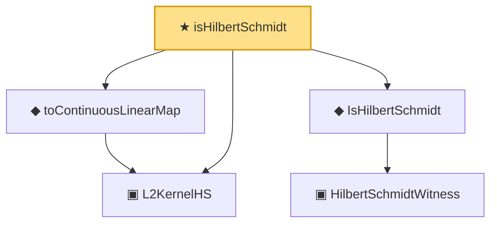

# Proof narrative — isHilbertSchmidt

Root: **isHilbertSchmidt** (theorem) `Statlib/Mathlib/Analysis/HilbertSchmidt.lean:244` · topic `Mathlib`
Closure: 5 declarations across 1 files. Generated from `proof_graph.json` — no files were moved.

Reading order (foundations first, headline last):

  ▣ `L2KernelHS` — structure · `Statlib/Mathlib/Analysis/HilbertSchmidt.lean:196`  _(also used by 3: kernelNormSq, kernelNormSq_nonneg, ofL2BoundedKernelOperator)_
    ▣ `HilbertSchmidtWitness` — structure · `Statlib/Mathlib/Analysis/HilbertSchmidt.lean:74`  _(also used by 1: toHilbertSchmidtWitness)_
  ◆ `IsHilbertSchmidt` — def · `Statlib/Mathlib/Analysis/HilbertSchmidt.lean:88`  _(also used by 10: IsHilbertSchmidt.isCompactOperator_via_truncate_complete, IsHilbertSchmidt_zero, IsHilbertSchmidt.smul, …)_
  ◆ `toContinuousLinearMap` — noncomputable def · `Statlib/Mathlib/Analysis/HilbertSchmidt.lean:232`  _(also used by 1: matrixToCLM)_
★ `isHilbertSchmidt` — theorem · `Statlib/Mathlib/Analysis/HilbertSchmidt.lean:244` **← headline**

## Dependency diagram

