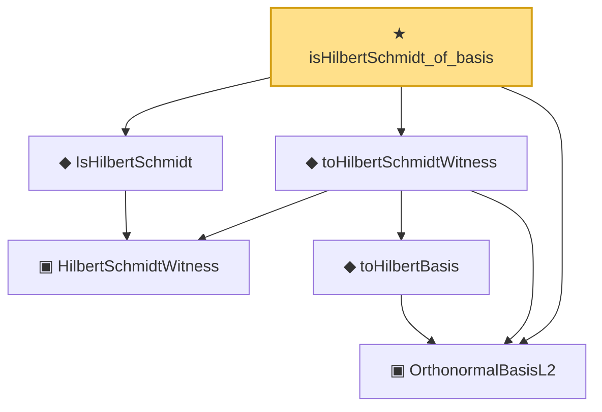

# Proof narrative — isHilbertSchmidt_of_basis

Root: **isHilbertSchmidt_of_basis** (theorem) `Statlib/Mathlib/MeasureTheory/L2Separable.lean:189` · topic `Mathlib`
Closure: 6 declarations across 2 files. Generated from `proof_graph.json` — no files were moved.

Reading order (foundations first, headline last):

  ▣ `OrthonormalBasisL2` — structure · `Statlib/Mathlib/MeasureTheory/L2Separable.lean:108`  _(also used by 6: L2Separable.toSeparableSpace, basis_norm_one, basis_orthogonal, …)_
    ▣ `HilbertSchmidtWitness` — structure · `Statlib/Mathlib/Analysis/HilbertSchmidt.lean:74`
  ◆ `IsHilbertSchmidt` — def · `Statlib/Mathlib/Analysis/HilbertSchmidt.lean:88`  _(also used by 10: IsHilbertSchmidt.isCompactOperator_via_truncate_complete, IsHilbertSchmidt_zero, IsHilbertSchmidt.smul, …)_
    ◆ `toHilbertBasis` — noncomputable def · `Statlib/Mathlib/MeasureTheory/L2Separable.lean:153`  _(also used by 2: SpectralTheoremCompactSA.toHilbertBasis, besselSquaredNormBound_of_total)_
  ◆ `toHilbertSchmidtWitness` — noncomputable def · `Statlib/Mathlib/MeasureTheory/L2Separable.lean:177`
★ `isHilbertSchmidt_of_basis` — theorem · `Statlib/Mathlib/MeasureTheory/L2Separable.lean:189` **← headline**

## Dependency diagram

