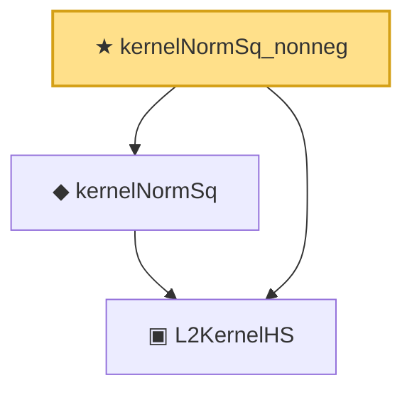

# Proof narrative — kernelNormSq_nonneg

Root: **kernelNormSq_nonneg** (theorem) `Statlib/Mathlib/Analysis/HilbertSchmidt.lean:216` · topic `Mathlib`
Closure: 3 declarations across 1 files. Generated from `proof_graph.json` — no files were moved.

Reading order (foundations first, headline last):

  ▣ `L2KernelHS` — structure · `Statlib/Mathlib/Analysis/HilbertSchmidt.lean:196`  _(also used by 3: toContinuousLinearMap, isHilbertSchmidt, ofL2BoundedKernelOperator)_
  ◆ `kernelNormSq` — noncomputable def · `Statlib/Mathlib/Analysis/HilbertSchmidt.lean:212`
★ `kernelNormSq_nonneg` — theorem · `Statlib/Mathlib/Analysis/HilbertSchmidt.lean:216` **← headline**

## Dependency diagram

