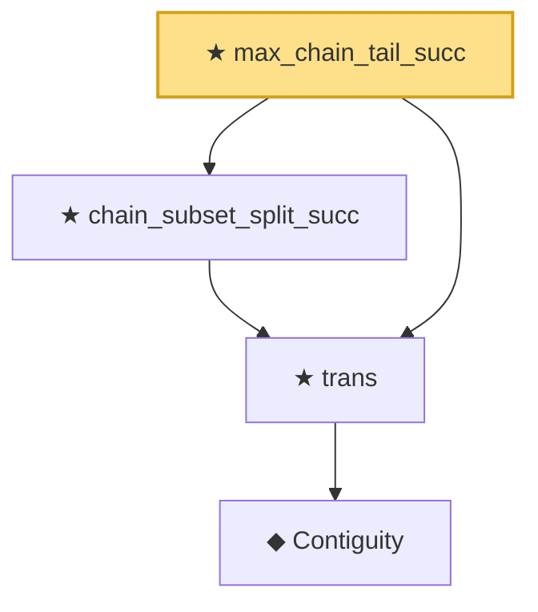

# Proof narrative — max_chain_tail_succ

Root: **max_chain_tail_succ** (theorem) `Statlib/Mathlib/EmpiricalProcess/VWChainingInduction.lean:458` · topic `Mathlib`
Closure: 4 declarations across 2 files. Generated from `proof_graph.json` — no files were moved.

Reading order (foundations first, headline last):

      ◆ `Contiguity` — def · `Statlib/Mathlib/Statistics/LeCamThirdLemma.lean:86`  _(also used by 8: LANToLeCamBundle, fromCoxScoreSample, identityCov, …)_
  ★ `trans` — theorem · `Statlib/Mathlib/Statistics/LeCamThirdLemma.lean:104`  _(also used by 10: davis_kahan_inner_bound, davis_kahan_finite_dim_squared, davisKahanSinTheta_of_finiteDim_aux, …)_
  ★ `chain_subset_split_succ` — theorem · `Statlib/Mathlib/EmpiricalProcess/VWChainingInduction.lean:419`
★ `max_chain_tail_succ` — theorem · `Statlib/Mathlib/EmpiricalProcess/VWChainingInduction.lean:458` **← headline**

## Dependency diagram

