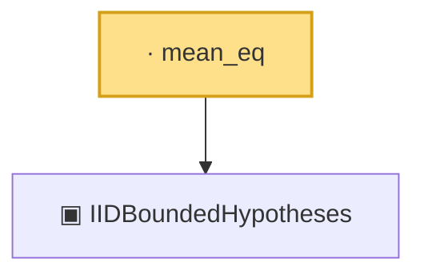

# Proof narrative — mean_eq

Root: **mean_eq** (lemma) `Statlib/Mathlib/ProbabilityTheory/CLTSums.lean:182` · topic `Mathlib`
Closure: 2 declarations across 1 files. Generated from `proof_graph.json` — no files were moved.

Reading order (foundations first, headline last):

  ▣ `IIDBoundedHypotheses` — structure · `Statlib/Mathlib/ProbabilityTheory/CLTSums.lean:129`  _(also used by 8: toConclusion, bound_pos, aestronglyMeasurable, …)_
· `mean_eq` — lemma · `Statlib/Mathlib/ProbabilityTheory/CLTSums.lean:182` **← headline**

## Dependency diagram

