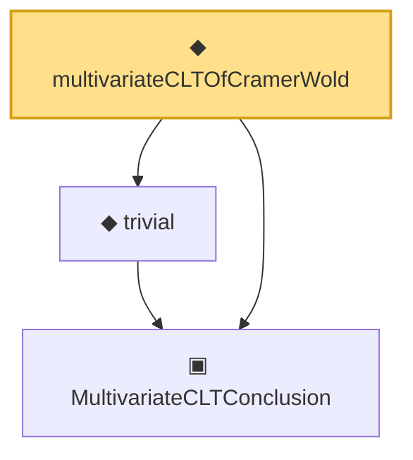

# Proof narrative — multivariateCLTOfCramerWold

Root: **multivariateCLTOfCramerWold** (noncomputable def) `Statlib/Mathlib/ProbabilityTheory/UnivariateCLTBridge.lean:174` · topic `Mathlib`
Closure: 3 declarations across 2 files. Generated from `proof_graph.json` — no files were moved.

Reading order (foundations first, headline last):

  ▣ `MultivariateCLTConclusion` — structure · `Statlib/Mathlib/ProbabilityTheory/MultivariateCLT.lean:138`  _(also used by 8: toConclusion, iidBounded, centralLimit_to_multivariateCLTConclusion, …)_
  ◆ `trivial` — def · `Statlib/Mathlib/ProbabilityTheory/MultivariateCLT.lean:161`  _(also used by 4: toConclusion, centralLimit_to_multivariateCLTConclusion, fromCoxScoreSample, …)_
◆ `multivariateCLTOfCramerWold` — noncomputable def · `Statlib/Mathlib/ProbabilityTheory/UnivariateCLTBridge.lean:174` **← headline**

## Dependency diagram

