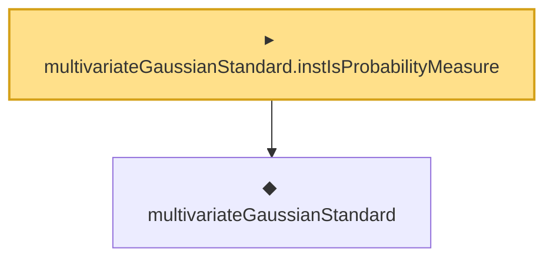

# Proof narrative — multivariateGaussianStandard.instIsProbabilityMeasure

Root: **multivariateGaussianStandard.instIsProbabilityMeasure** (instance) `Statlib/Mathlib/ProbabilityTheory/MultivariateCLT.lean:85` · topic `Mathlib`
Closure: 2 declarations across 1 files. Generated from `proof_graph.json` — no files were moved.

Reading order (foundations first, headline last):

  ◆ `multivariateGaussianStandard` — noncomputable def · `Statlib/Mathlib/ProbabilityTheory/MultivariateCLT.lean:80`
▸ `multivariateGaussianStandard.instIsProbabilityMeasure` — instance · `Statlib/Mathlib/ProbabilityTheory/MultivariateCLT.lean:85` **← headline**

## Dependency diagram

