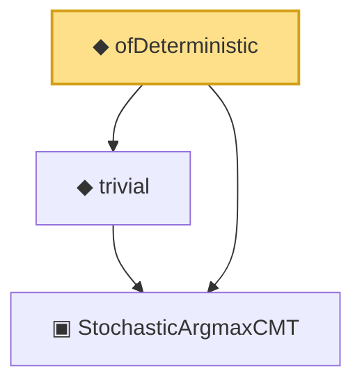

# Proof narrative — ofDeterministic

Root: **ofDeterministic** (def) `Statlib/Mathlib/ProbabilityTheory/ArgmaxCMT.lean:210` · topic `Mathlib`
Closure: 3 declarations across 1 files. Generated from `proof_graph.json` — no files were moved.

Reading order (foundations first, headline last):

  ▣ `StochasticArgmaxCMT` — structure · `Statlib/Mathlib/ProbabilityTheory/ArgmaxCMT.lean:179`
  ◆ `trivial` — def · `Statlib/Mathlib/ProbabilityTheory/ArgmaxCMT.lean:199`  _(also used by 1: centralLimit_real_to_existing)_
◆ `ofDeterministic` — def · `Statlib/Mathlib/ProbabilityTheory/ArgmaxCMT.lean:210` **← headline**

## Dependency diagram

