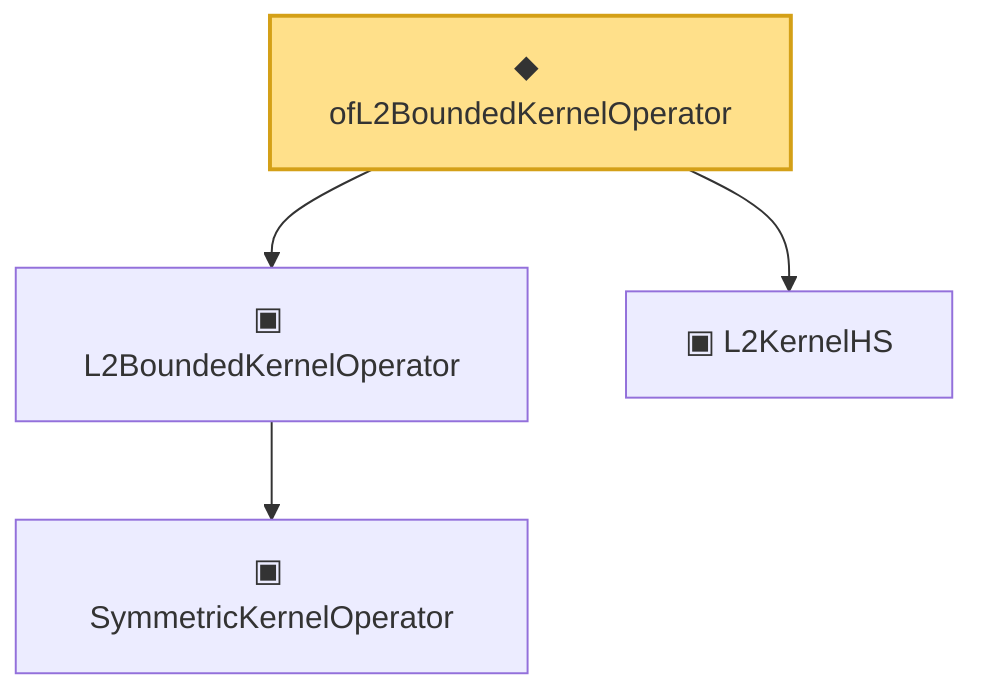

# Proof narrative — ofL2BoundedKernelOperator

Root: **ofL2BoundedKernelOperator** (noncomputable def) `Statlib/Mathlib/Analysis/HilbertSchmidt.lean:269` · topic `Mathlib`
Closure: 4 declarations across 3 files. Generated from `proof_graph.json` — no files were moved.

Reading order (foundations first, headline last):

    ▣ `SymmetricKernelOperator` — structure · `Statlib/CoxChangePoint/SpectralOperator.lean:103`  _(also used by 4: L2BoundedKernelOperator.ofSymmetric, ofEmpiricalCov, HasEigendecomposition, …)_
  ▣ `L2BoundedKernelOperator` — structure · `Statlib/CoxChangePoint/L2Operator.lean:212`  _(also used by 6: integralAction_integral_sq_le, L2BoundedKernelOperator.ofSymmetric, integralAction_smul, …)_
  ▣ `L2KernelHS` — structure · `Statlib/Mathlib/Analysis/HilbertSchmidt.lean:196`  _(also used by 4: kernelNormSq, kernelNormSq_nonneg, toContinuousLinearMap, …)_
◆ `ofL2BoundedKernelOperator` — noncomputable def · `Statlib/Mathlib/Analysis/HilbertSchmidt.lean:269` **← headline**

## Dependency diagram

