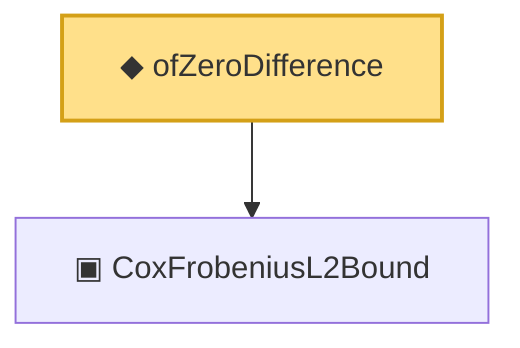

# Proof narrative — ofZeroDifference

Root: **ofZeroDifference** (noncomputable def) `Statlib/Mathlib/ProbabilityTheory/CoxCovOpNormBound.lean:212` · topic `Mathlib`
Closure: 2 declarations across 1 files. Generated from `proof_graph.json` — no files were moved.

Reading order (foundations first, headline last):

  ▣ `CoxFrobeniusL2Bound` — structure · `Statlib/Mathlib/ProbabilityTheory/CoxCovOpNormBound.lean:141`  _(also used by 3: sq_M_pos, toOpNormBound, CoxIIDBundle)_
◆ `ofZeroDifference` — noncomputable def · `Statlib/Mathlib/ProbabilityTheory/CoxCovOpNormBound.lean:212` **← headline**

## Dependency diagram

