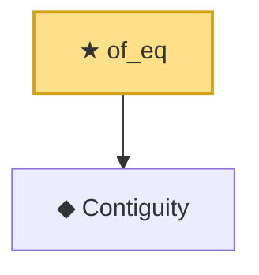

# Proof narrative — of_eq

Root: **of_eq** (theorem) `Statlib/Mathlib/Statistics/LeCamThirdLemma.lean:112` · topic `Mathlib`
Closure: 2 declarations across 1 files. Generated from `proof_graph.json` — no files were moved.

Reading order (foundations first, headline last):

  ◆ `Contiguity` — def · `Statlib/Mathlib/Statistics/LeCamThirdLemma.lean:86`  _(also used by 8: LANToLeCamBundle, fromCoxScoreSample, identityCov, …)_
★ `of_eq` — theorem · `Statlib/Mathlib/Statistics/LeCamThirdLemma.lean:112` **← headline**

## Dependency diagram

