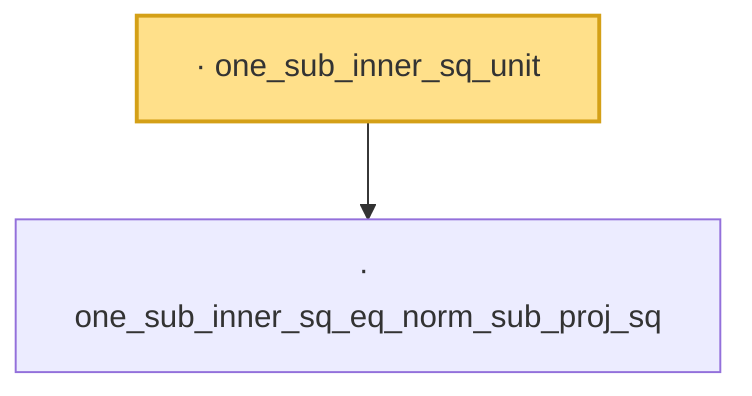

# Proof narrative — one_sub_inner_sq_unit

Root: **one_sub_inner_sq_unit** (lemma) `Statlib/Mathlib/Analysis/DavisKahan.lean:113` · topic `Mathlib`
Closure: 2 declarations across 1 files. Generated from `proof_graph.json` — no files were moved.

Reading order (foundations first, headline last):

  · `one_sub_inner_sq_eq_norm_sub_proj_sq` — lemma · `Statlib/Mathlib/Analysis/DavisKahan.lean:92`
· `one_sub_inner_sq_unit` — lemma · `Statlib/Mathlib/Analysis/DavisKahan.lean:113` **← headline**

## Dependency diagram

