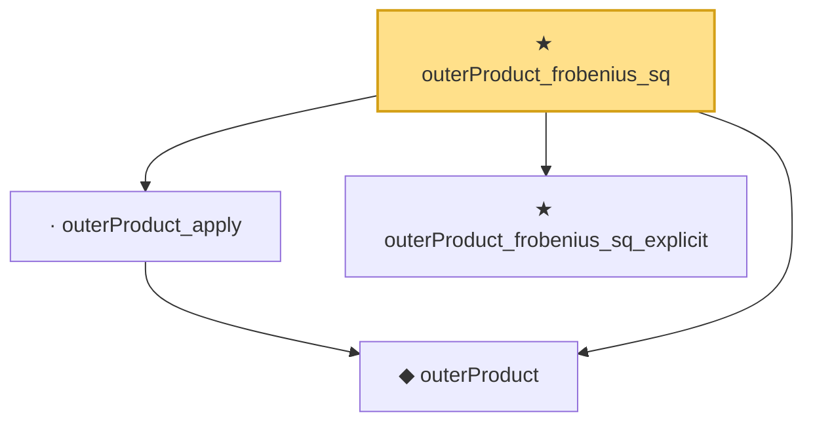

# Proof narrative — outerProduct_frobenius_sq

Root: **outerProduct_frobenius_sq** (theorem) `Statlib/Mathlib/ProbabilityTheory/CoxCovOpNormBound.lean:95` · topic `Mathlib`
Closure: 4 declarations across 1 files. Generated from `proof_graph.json` — no files were moved.

Reading order (foundations first, headline last):

  ◆ `outerProduct` — noncomputable def · `Statlib/Mathlib/ProbabilityTheory/CoxCovOpNormBound.lean:56`  _(also used by 1: outerProduct_isSymm)_
  · `outerProduct_apply` — lemma · `Statlib/Mathlib/ProbabilityTheory/CoxCovOpNormBound.lean:61`
  ★ `outerProduct_frobenius_sq_explicit` — theorem · `Statlib/Mathlib/ProbabilityTheory/CoxCovOpNormBound.lean:78`
★ `outerProduct_frobenius_sq` — theorem · `Statlib/Mathlib/ProbabilityTheory/CoxCovOpNormBound.lean:95` **← headline**

## Dependency diagram

