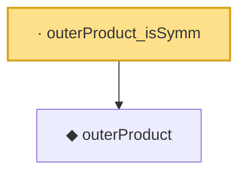

# Proof narrative — outerProduct_isSymm

Root: **outerProduct_isSymm** (lemma) `Statlib/Mathlib/ProbabilityTheory/CoxCovOpNormBound.lean:65` · topic `Mathlib`
Closure: 2 declarations across 1 files. Generated from `proof_graph.json` — no files were moved.

Reading order (foundations first, headline last):

  ◆ `outerProduct` — noncomputable def · `Statlib/Mathlib/ProbabilityTheory/CoxCovOpNormBound.lean:56`  _(also used by 2: outerProduct_apply, outerProduct_frobenius_sq)_
· `outerProduct_isSymm` — lemma · `Statlib/Mathlib/ProbabilityTheory/CoxCovOpNormBound.lean:65` **← headline**

## Dependency diagram

