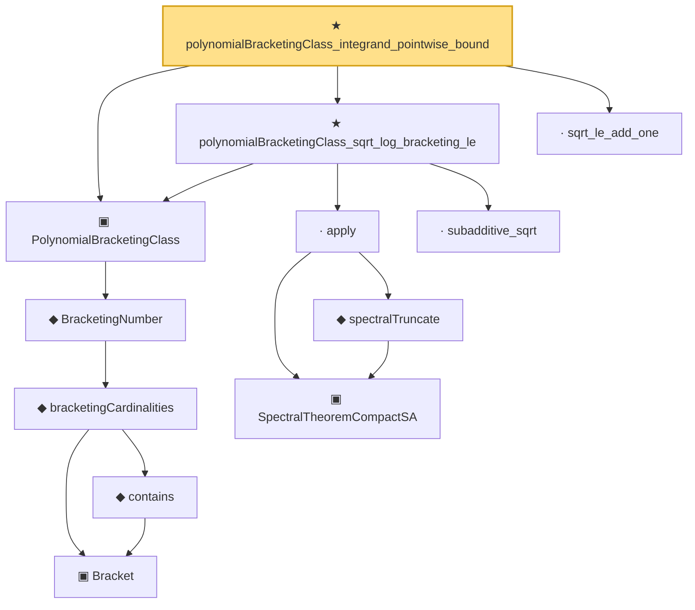

# Proof narrative — polynomialBracketingClass_integrand_pointwise_bound

Root: **polynomialBracketingClass_integrand_pointwise_bound** (theorem) `Statlib/Mathlib/EmpiricalProcess/BracketingIntegralConv.lean:263` · topic `Mathlib`
Closure: 12 declarations across 4 files. Generated from `proof_graph.json` — no files were moved.

Reading order (foundations first, headline last):

        ▣ `Bracket` — structure · `Statlib/CoxChangePoint/BracketingEntropy.lean:58`  _(also used by 3: lower_le_of_contains, le_upper_of_contains, HasBracketing)_
        ◆ `contains` — def · `Statlib/CoxChangePoint/BracketingEntropy.lean:79`  _(also used by 3: lower_le_of_contains, le_upper_of_contains, HasBracketing)_
      ◆ `bracketingCardinalities` — def · `Statlib/CoxChangePoint/BracketingEntropy.lean:111`  _(also used by 3: BracketingNumber_lt_top_of_hasBracketing, hasBracketing_of_bracketingNumber_lt_top, coveringLeBracketing_trivial_of_no_bracketing)_
    ◆ `BracketingNumber` — noncomputable def · `Statlib/CoxChangePoint/BracketingEntropy.lean:120`  _(also used by 6: BracketingNumber_lt_top_of_hasBracketing, hasBracketing_of_bracketingNumber_lt_top, bracketingEntropy, …)_
  ▣ `PolynomialBracketingClass` — structure · `Statlib/Mathlib/EmpiricalProcess/BracketingIntegralConv.lean:164`  _(also used by 12: bound_pos, polynomialBracketingClass_log_bracketing_le, PolynomialBracketingClass.toVW_2_14_9_Conclusion, …)_
      ▣ `SpectralTheoremCompactSA` — structure · `Statlib/Mathlib/Analysis/SpectralCompactSelfAdjoint.lean:299`  _(also used by 31: SpectralEigenbasisIsTotal, SpectralTheoremCompactSA.toHilbertBasis, inner_eigenfn_spectralTruncate_lt, …)_
      ◆ `spectralTruncate` — noncomputable def · `Statlib/Mathlib/Analysis/SpectralTruncation.lean:98`  _(also used by 17: inner_eigenfn_spectralTruncate_lt, inner_eigenfn_spectralTruncate_ge, inner_eigenfn_residual, …)_
    · `apply` — lemma · `Statlib/Mathlib/Analysis/SpectralTruncation.lean:107`  _(also used by 13: inner_eigenfn_spectralTruncate_lt, inner_eigenfn_spectralTruncate_ge, isCompactOperator_of_op_norm_tendsto, …)_
    · `subadditive_sqrt` — lemma · `Statlib/Mathlib/EmpiricalProcess/BracketingIntegralConv.lean:82`
  ★ `polynomialBracketingClass_sqrt_log_bracketing_le` — theorem · `Statlib/Mathlib/EmpiricalProcess/BracketingIntegralConv.lean:223`
  · `sqrt_le_add_one` — lemma · `Statlib/Mathlib/EmpiricalProcess/BracketingIntegralConv.lean:100`  _(also used by 1: integral_neg_log_finite)_
★ `polynomialBracketingClass_integrand_pointwise_bound` — theorem · `Statlib/Mathlib/EmpiricalProcess/BracketingIntegralConv.lean:263` **← headline**

## Dependency diagram

