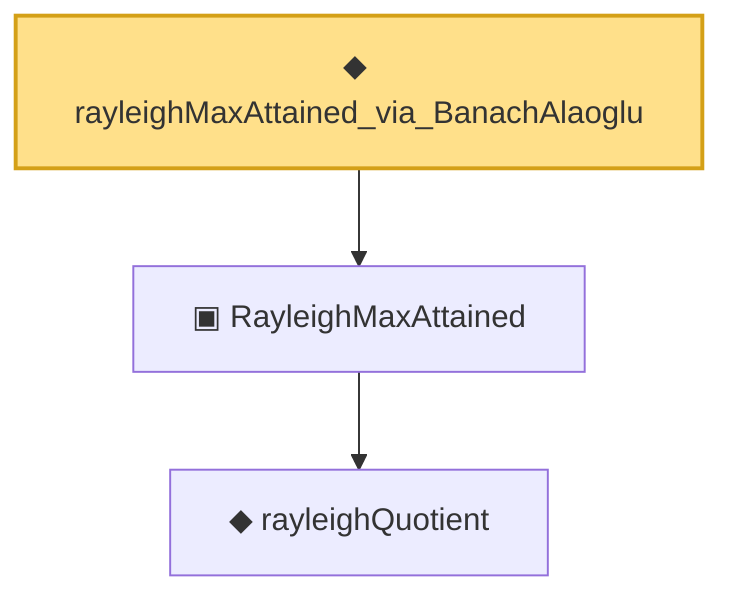

# Proof narrative — rayleighMaxAttained_via_BanachAlaoglu

Root: **rayleighMaxAttained_via_BanachAlaoglu** (noncomputable def) `Statlib/Mathlib/Analysis/BanachAlaoglu.lean:207` · topic `Mathlib`
Closure: 3 declarations across 2 files. Generated from `proof_graph.json` — no files were moved.

Reading order (foundations first, headline last):

    ◆ `rayleighQuotient` — noncomputable def · `Statlib/Mathlib/Analysis/RayleighMax.lean:81`  _(also used by 4: rayleighQuotient_continuous, rayleighQuotient_bounded_by_op_norm, rayleigh_zero_op, …)_
  ▣ `RayleighMaxAttained` — structure · `Statlib/Mathlib/Analysis/RayleighMax.lean:138`  _(also used by 2: rayleigh_max_is_eigenvector, RayleighMaxAttained.toRieszSchauder)_
◆ `rayleighMaxAttained_via_BanachAlaoglu` — noncomputable def · `Statlib/Mathlib/Analysis/BanachAlaoglu.lean:207` **← headline**

## Dependency diagram

