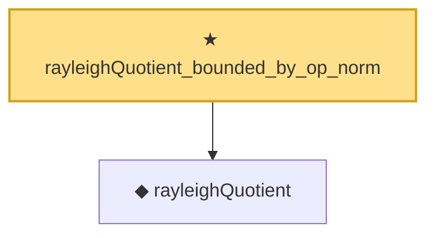

# Proof narrative — rayleighQuotient_bounded_by_op_norm

Root: **rayleighQuotient_bounded_by_op_norm** (theorem) `Statlib/Mathlib/Analysis/RayleighMax.lean:97` · topic `Mathlib`
Closure: 2 declarations across 1 files. Generated from `proof_graph.json` — no files were moved.

Reading order (foundations first, headline last):

  ◆ `rayleighQuotient` — noncomputable def · `Statlib/Mathlib/Analysis/RayleighMax.lean:81`  _(also used by 4: rayleighQuotient_continuous, rayleigh_zero_op, RayleighMaxAttained, …)_
★ `rayleighQuotient_bounded_by_op_norm` — theorem · `Statlib/Mathlib/Analysis/RayleighMax.lean:97` **← headline**

## Dependency diagram

