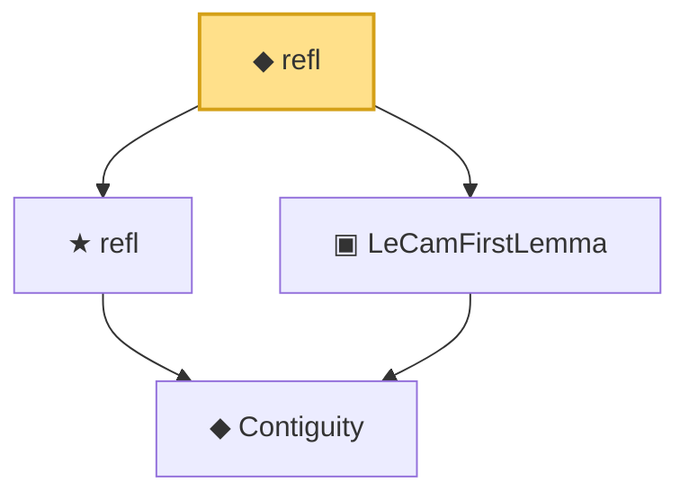

# Proof narrative — refl

Root: **refl** (def) `Statlib/Mathlib/Statistics/LeCamThirdLemma.lean:143` · topic `Mathlib`
Closure: 4 declarations across 1 files. Generated from `proof_graph.json` — no files were moved.

Reading order (foundations first, headline last):

    ◆ `Contiguity` — def · `Statlib/Mathlib/Statistics/LeCamThirdLemma.lean:86`  _(also used by 7: LANToLeCamBundle, fromCoxScoreSample, identityCov, …)_
  ★ `refl` — theorem · `Statlib/Mathlib/Statistics/LeCamThirdLemma.lean:98`  _(also used by 1: selfBundle)_
  ▣ `LeCamFirstLemma` — structure · `Statlib/Mathlib/Statistics/LeCamThirdLemma.lean:131`
◆ `refl` — def · `Statlib/Mathlib/Statistics/LeCamThirdLemma.lean:143` **← headline**

## Dependency diagram

