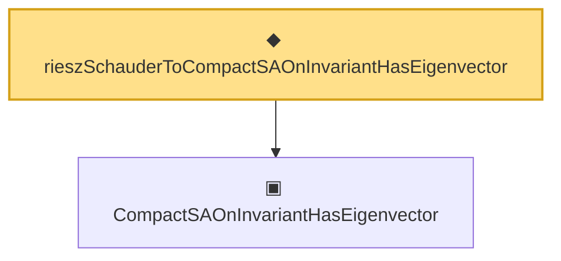

# Proof narrative — rieszSchauderToCompactSAOnInvariantHasEigenvector

Root: **rieszSchauderToCompactSAOnInvariantHasEigenvector** (def) `Statlib/Mathlib/Analysis/RieszSchauder.lean:138` · topic `Mathlib`
Closure: 2 declarations across 2 files. Generated from `proof_graph.json` — no files were moved.

Reading order (foundations first, headline last):

  ▣ `CompactSAOnInvariantHasEigenvector` — structure · `Statlib/Mathlib/Analysis/EigenbasisTotality.lean:190`  _(also used by 1: eigenbasis_total_of_invariant_subspace_eigenvector)_
◆ `rieszSchauderToCompactSAOnInvariantHasEigenvector` — def · `Statlib/Mathlib/Analysis/RieszSchauder.lean:138` **← headline**

## Dependency diagram

