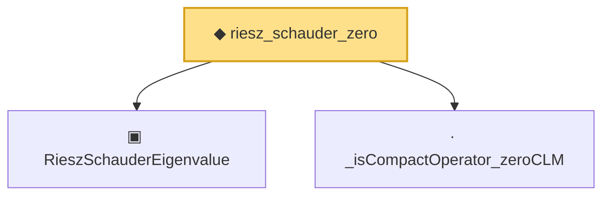

# Proof narrative — riesz_schauder_zero

Root: **riesz_schauder_zero** (noncomputable def) `Statlib/Mathlib/Analysis/RieszSchauder.lean:107` · topic `Mathlib`
Closure: 3 declarations across 1 files. Generated from `proof_graph.json` — no files were moved.

Reading order (foundations first, headline last):

  ▣ `RieszSchauderEigenvalue` — structure · `Statlib/Mathlib/Analysis/RieszSchauder.lean:79`  _(also used by 1: RayleighMaxAttained.toRieszSchauder)_
  · `_isCompactOperator_zeroCLM` — private lemma · `Statlib/Mathlib/Analysis/RieszSchauder.lean:99`
◆ `riesz_schauder_zero` — noncomputable def · `Statlib/Mathlib/Analysis/RieszSchauder.lean:107` **← headline**

## Dependency diagram

