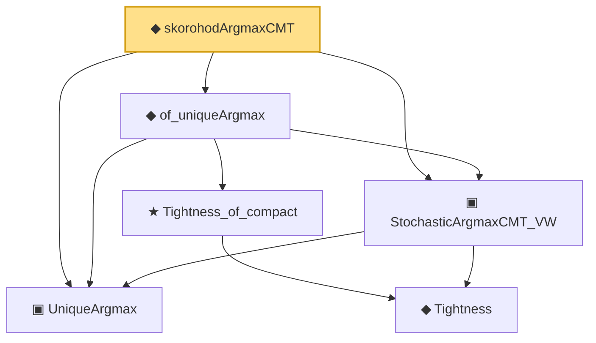

# Proof narrative — skorohodArgmaxCMT

Root: **skorohodArgmaxCMT** (def) `Statlib/Mathlib/ProbabilityTheory/SkorohodArgmax.lean:200` · topic `Mathlib`
Closure: 6 declarations across 2 files. Generated from `proof_graph.json` — no files were moved.

Reading order (foundations first, headline last):

  ▣ `UniqueArgmax` — structure · `Statlib/Mathlib/ProbabilityTheory/StochasticArgmax.lean:99`
    ◆ `Tightness` — def · `Statlib/Mathlib/ProbabilityTheory/StochasticArgmax.lean:65`
  ▣ `StochasticArgmaxCMT_VW` — structure · `Statlib/Mathlib/ProbabilityTheory/StochasticArgmax.lean:172`
    ★ `Tightness_of_compact` — theorem · `Statlib/Mathlib/ProbabilityTheory/StochasticArgmax.lean:75`
  ◆ `of_uniqueArgmax` — def · `Statlib/Mathlib/ProbabilityTheory/StochasticArgmax.lean:200`
◆ `skorohodArgmaxCMT` — def · `Statlib/Mathlib/ProbabilityTheory/SkorohodArgmax.lean:200` **← headline**

## Dependency diagram

