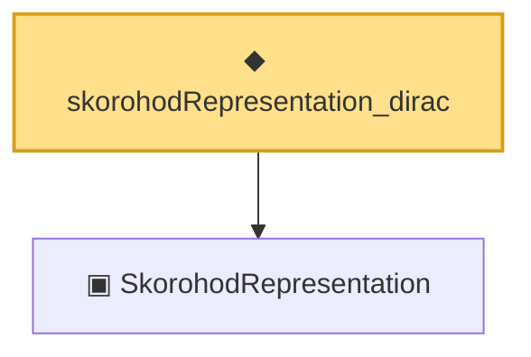

# Proof narrative — skorohodRepresentation_dirac

Root: **skorohodRepresentation_dirac** (noncomputable def) `Statlib/Mathlib/ProbabilityTheory/SkorohodArgmax.lean:137` · topic `Mathlib`
Closure: 2 declarations across 1 files. Generated from `proof_graph.json` — no files were moved.

Reading order (foundations first, headline last):

  ▣ `SkorohodRepresentation` — structure · `Statlib/Mathlib/ProbabilityTheory/SkorohodArgmax.lean:76`  _(also used by 1: WeakConvImpliesSkorohod)_
◆ `skorohodRepresentation_dirac` — noncomputable def · `Statlib/Mathlib/ProbabilityTheory/SkorohodArgmax.lean:137` **← headline**

## Dependency diagram

