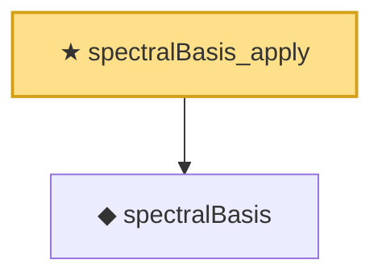

# Proof narrative — spectralBasis_apply

Root: **spectralBasis_apply** (theorem) `Statlib/Mathlib/Analysis/SpectralCompactSelfAdjoint.lean:168` · topic `Mathlib`
Closure: 2 declarations across 1 files. Generated from `proof_graph.json` — no files were moved.

Reading order (foundations first, headline last):

  ◆ `spectralBasis` — noncomputable def · `Statlib/Mathlib/Analysis/SpectralCompactSelfAdjoint.lean:161`
★ `spectralBasis_apply` — theorem · `Statlib/Mathlib/Analysis/SpectralCompactSelfAdjoint.lean:168` **← headline**

## Dependency diagram

