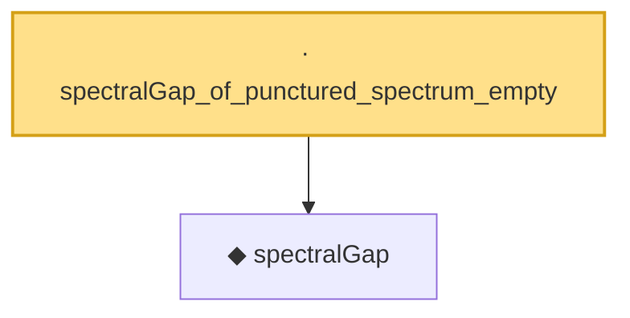

# Proof narrative — spectralGap_of_punctured_spectrum_empty

Root: **spectralGap_of_punctured_spectrum_empty** (lemma) `Statlib/Mathlib/Analysis/DavisKahan.lean:131` · topic `Mathlib`
Closure: 2 declarations across 1 files. Generated from `proof_graph.json` — no files were moved.

Reading order (foundations first, headline last):

  ◆ `spectralGap` — noncomputable def · `Statlib/Mathlib/Analysis/DavisKahan.lean:127`  _(also used by 2: spectralGap_le_dist_of_mem, spectralGap_nonneg)_
· `spectralGap_of_punctured_spectrum_empty` — lemma · `Statlib/Mathlib/Analysis/DavisKahan.lean:131` **← headline**

## Dependency diagram

